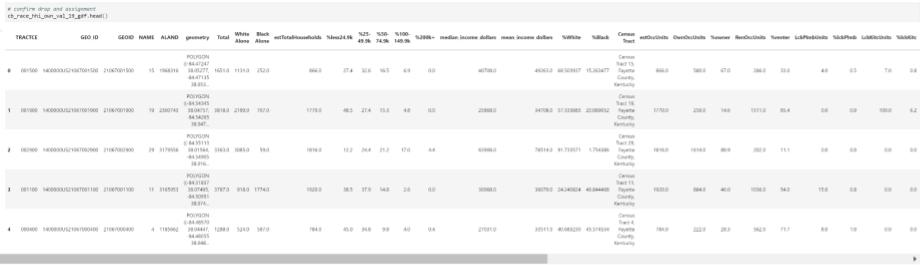
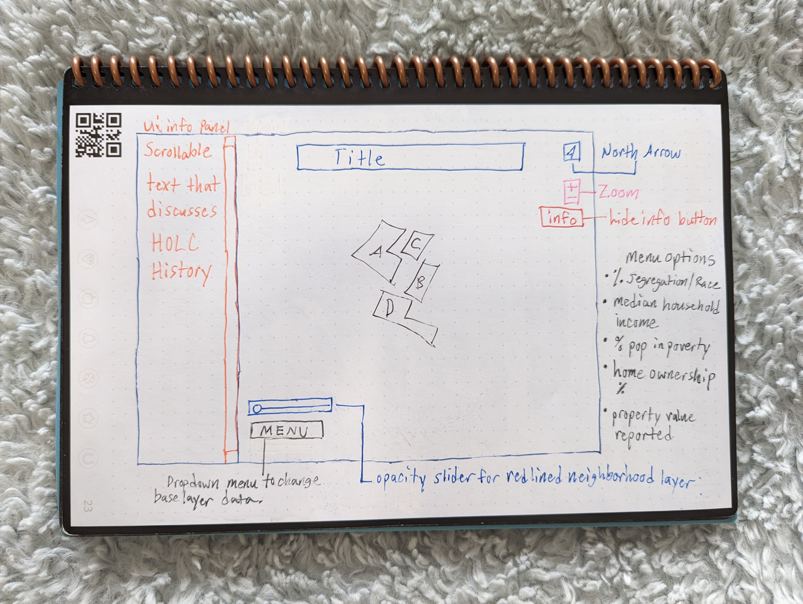

# redlining-wealth-lexington
A repo for exploring a final thesis project related to the wealth ripples through time formed by Redlining in Lexington, Kentucky.

<!-- TOC -->

## Table of Contents
- [Part I. Project Summary Proposal](#part-i-project-summary-proposal)  
- [Part II. Data Sources](#part-ii-data-sources)  
    - [HOLC Neighborhoods](#holc-neighborhoods)
    - [Aspects of Wealth](#aspects-of-wealth)
        - [Race & Segregation](#race-&-segregation)
        - [Median Household income](#median-houshold-income)
        - [Mortgage Approval Rates through time](#mortgage-approval-rates-through-time) 
        - [Percent Home Ownership today & Owner Reported Property Value Today](#percet-home-ownership-today-&-owner-reported-property-value-today)
        - [Percent of Population in Poverty](#percent-of-population-in-poverty)
- [Part III. Proposed Visuals](#part-iii-proposed-visuals)
- [Part IV. Objectives & User Needs](#part-iv-objectives-&-user-needs)
- [Part V. Data Processing & Storage](#part-v-data-processing-&-storage)
- [Part VI. Data Stack and JS Libraries to Employ](#part-vi-data-stack-and-js-libraries-to-employ)
- [Part VII. Layout](#part-vii-layout)
- [Inspiration](#inspiration)
- [References for readme](#references-for-readme)  

<!-- /TOC -->

## Part I: Project Summary Proposal

Title: How Racial Capitalism Persists today in Lexington, KY
Sub-title: An exploration of 1930s Redlining Practices

Crampton indicated that *"maps are active and not passive"* and *"they frame the narrative"* (Crampton 2014). As such I propose a project to expolore the ripples left behind by the Home Owner's Loan Corporation Redlining Neighborhood Map *Narrative* of Lexington Kentucky and what *Active* results can be interpreted from the fingerprent left behind by the HOLC map. 

Within this project I will design a map that explores the access (or denial of equitable access) to generational wealth for the current location of historically redlined neighborhoods. The aspects of wealth being considered include:
- Race 
- Median Household Income
- Home Ownership
- Reported Property Value 
- Poverty Level

I want to find out what inequities have persisted generation to generation in order to help the user understand the impacts inherited by 1930s redlined policies in these neighborhoods through time.

As demand increases for living in close proximity to the Central Business District and its accompanying improved amenities, redlined neighborhoods are at risk of gentrification. It is hoped that maps such as the one I propose can inform a user to make more thoughtful decisions with their votes within the Lexington cityscape. Voting can enact better policies to promote community renewal and prevent the gentrification of these areas. Policy changes are how we will begin the effort toward equity for the long term resident's access to benefit from revitalized areas they have been excluded from in the past.

## Part II: Data Sources

### HOLC Neighborhoods
All data mapped will be in comparison with the redlined neighborhoods of Lexington GeoJSON provided through [Mapping Inequality](https://dsl.richmond.edu/panorama/redlining/#loc=15/38.046/-84.534&city=lexington-ky&text=downloads) (Nelson, Winling, Marciano, Connolly et al.).
- Data Available as:
    - Shapefile or GeoJSON
    - Georectified Image
    - Scan jpg 

### Aspects of Wealth
Exploring wealth under the umbrella of the ability to accumulate generational wealth through home ownership.

#### Race & Segregation
[*Race for the Population 18 years+ 2020*](https://data.census.gov/cedsci/table?q=p3&t=Race%20and%20Ethnicity&g=0500000US21067%241400000&y=2020)
- All of Fayette County 
- Data available to download:
    - CSV metadata (10 kb)
    - CSV file data (40 kb)
    - TXT file table title (1 kb)

#### Median Household income
[*S1901 Income in the past 12 months (in 2019 inflation-adjusted dollars)*](https://data.census.gov/cedsci/table?q=income&g=0500000US21067%241400000&y=2019)
- Only census tracts clipped by HOLC were downloaded from website
- Data available to download: 
    - CSV file metadata (11 kb)
    - CSV file data (34 kb)
    - TXT file table title (6 kb)

#### Percent Home Ownership today & Owner Reported Property Value Today
[*US census bureau American Community Survey DP04 2019*](https://data.census.gov/cedsci/table?q=DP04&g=0500000US21067%241400000)
- Only census tracts clipped by HOLC were downloaded from website
- Data available to download:
    - CSV file metadata (61 kb)
    - CSV file data (150 kb)
    - TXT file table title (5 kb)

#### Percent of Population in Poverty
[*S1701 Poverty Status in the past 12 months (ACS)*](https://data.census.gov/cedsci/table?q=s1701&g=0500000US21067%241400000&y=2019)
- Data available to download:
    - CSV File Metadata
    - CSV file data
    - TXT file table title

## Part III. Proposed Visuals

### Historical Visuals to Provide context
Timeline of images from papers, covenants, HOLC plat, or historic journal article map depictions. Potentially store these within the info box panel on the left hand side to give historical context.

HOLC Map scanned from 1930s

Articles of interest:
- Harriss, C.L. History and Policies of the Home Owners' Loan Corporation (1951)  
- Kellogg, John. 1977. Negro Urban Clusters in the Posbellum South. Geographical Review. Vol 67. No 3. pp. 310-321.  
- Kellogg, John. 1982. The Formation of Black Residential Areas in Lexington, Kentucky 1865-1887. Southern Historical Association. Vol 48. No 1. pp. 21-52.  
- Kendi, Ibram. 2016. Stamped from the Beginning The Definitive History of Racist Ideas in America. New York, Bold Type Books. pp 583.   
- O'Malley, Nancy. 2002. The Pursuit of Freedom The Evolution of Kinkeadtown, an African American Post-Civil War Neighborhood in Lexington, Kentucky. Winterthur Portfolio. Vol 37. No. 4. pp. 187-218.  
- Rabinowitz, Howard. 1976. From Reconstruction to Redemption in the Urban South. Journal of Urban History. Vol 2. No 2. pp 169-194  
    
## Part IV. Objectives & User Needs
INFORMATION HERE WILL FOR OBJECTIVE WILL BE PULLED FROM BACGRKOUND.MD

User will need to be able to make comparisons between the HOLC neighborhood grades and the current status of a data set (simultaneously) within/across those graded areas. HOLC layer will be a polygon layer whose outline color will correspond to grade level/hazard risk assigned by HOLC. HOLC grades traditionally used Green (Grade A)-Blue (Grade B)-Yellow (Grade C)-Red (Grade D). All other data sets will be colored based on polygon of census bureau tract data in a color ramp. Since the census bureau tracts will not always align with HOLC grades UI/UX will be utilized to interpret data in the same space.

The following UI/UX items will be included to make the experience personalized and map view uncomplicated:  

- ui info Panel with scroll bar. Text within to give historical context of information viwed on map
- Drop-up menu button so user can select data interested in viewing. Menu Options:
    - % segregtation/race
    - median household income
    - % home ownership
    - property value reported by owner
    - % population in poverty
- Slider bar controlling opacity level of overlayed HOLC neighborhood gradings/polygons.
- North arrow for user to orient themselves
- Zoom for closer views
- Info button to hide/reveal ui info panel

## Part V. Data Processing & Storage
Unprocessed data to be downloaded, date accessed notated above in Part II, unzipped and stored initially in the notebooks/data directory of this repo. Files are included on .gitignore to prevent excessive file sizes being pushed to github repo. Data will be loaded into a [Python/Jupyter Notebook](notebooks/lex-redlined-wealth.ipynb) for pre-processing. Specific steps in processing data will be indicated using markdown cells in the Jupyter Notebook, including the code used to process. Finalized data will be written to JSON file from Jupyter Notebook to data folder within repo directory as opposed to data folder within notebook directory.

Environmental Dependencies Anticipated:
- [jupyter notebook](https://jupyter-notebook.readthedocs.io/en/stable/) 1.0.0
- [numpy](https://numpy.org/doc/) 1.22.1
- [geopandas](https://geopandas.org/en/stable/docs.html) 0.10.2
- [pandas](https://pandas.pydata.org/pandas-docs/version/1.4/index.html) 1.4.0
- [matplotlib](https://matplotlib.org/stable/users/index) 3.5.1

Example of cleaned data 

*data still lacks poverty information and race beyond black/white

## Part VI. Data Stack and JS Libraries to Employ
- HTML/SVG/CSS for ui/ux and website styling
- [Mapbox GLJS](https://www.mapbox.com/mapbox-gljs) for loading vector tiles and smooth interaction
- [D3.js](https://d3js.org/) to load data as json
- [Chroma.js](https://gka.github.io/chroma.js/) potentially for color scale
- [Sparkline.js](https://omnipotent.net/jquery.sparkline/#s-about) potentially for tooltip specs of data or graphing

## Part VII. Layout
### Mockup WireFrame 1

**Figure 1.** Mockup wireframe 1st proposal for project's html look and feel with user interaction buttons labeled.

A similar project to reference was 673 4-5.

## Inspiration
- [ramp styling 2020 census by race](https://mtgis-portal.geo.census.gov/arcgis/apps/MapSeries/index.html?appid=2566121a73de463995ed2b2fd7ff6eb7)
- [overlap of holc designations & secondary ramp map](https://lojic.maps.arcgis.com/apps/MapSeries/index.html?appid=e4d29907953c4094a17cb9ea8f8f89de)

## References (of this readme.md)
- Crampton, J.W. 2014. The power of maps. In: Cloke, P., Crang, P., Goodwin, M. (Eds.), Introducing human geographies, 3. Hodder Education London.
- Robert K. Nelson, LaDale Winling, Richard Marciano, Nathan Connolly, et al., “Mapping Inequality,” American Panorama, ed. Robert K. Nelson and Edward L. Ayers, accessed January 25, 2022, https://dsl.richmond.edu/panorama/redlining//#loc=14/38.041/-84.526&city=lexington-ky&text=downloads

